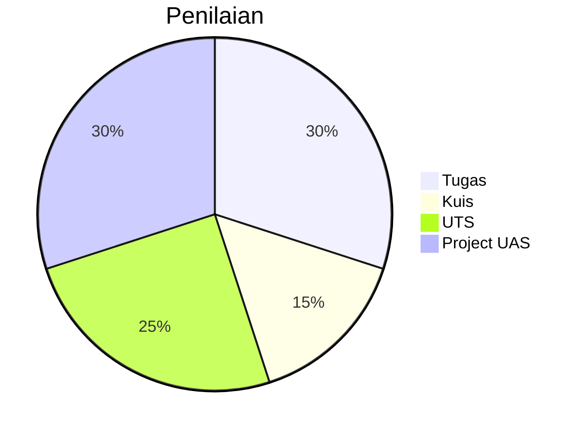

# Penilaian 📈

Presentase nilai yang diambil adalah:
- 30% dari tugas 
- 15% dari kuis
- 25% dari UTS
- 30% dari project UAS.

```mermaid   {theme: 'dark', scale: 0.5, useMaxWidth: false}
  pie title Penilaian
    "Tugas" : 30
    "Kuis" : 15
    "UTS" : 25
    "Project UAS" : 30
```

 